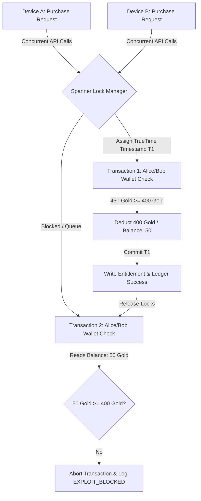

# ChronosLedger: Globally Distributed virtual Economy & Entitlements Ledger

ChronosLedger is a gaming-commerce reference architecture built on **Google Cloud Spanner**. It demonstrates how to build and orchestrate globally consistent virtual game economies, store checkouts, and player entitlement ledgers.

---

## 🎮 The Business Challenge: Virtual Economy Exploits

For game studios, the virtual economy is the lifeblood of player revenue. A primary target for hackers is the **Item Duplication Exploit** (a race-condition hack). 
*   **The Scenario**: A player logs into their account on two devices simultaneously. They trigger a purchase for a high-value item (costing 400 gold) at the exact same millisecond, when their account balance is only enough for one (e.g., 450 gold).
*   **The Failure (Traditional Databases)**: Without complex, slow application-tier locking or strict serializable isolation, both transactions read the balance before either writes. Both approve, resulting in the player getting two items (duplication) and their balance dropping below zero—ruining the economy balance.
*   **The Spanner Wedge**: Spanner natively resolves this at the database engine tier, ensuring strict transaction ordering globally with zero lag-inducing locks.

---

## 🚀 The Technical Solution: Cloud Spanner & TrueTime

ChronosLedger showcases how Google Cloud Spanner solves global transactional consistency:

### Concurrency & Serialization Flow


### 1. TrueTime Atomic Clocks
Spanner uses **TrueTime**, a highly synchronized API backed by GPS receivers and atomic clocks inside Google data centers. 
TrueTime assigns absolute, globally ordered timestamps to transactions. Even if two checkout requests hit servers on opposite sides of the world (e.g., Tokyo and Frankfurt) at the same millisecond, Spanner knows which request arrived first and processes them sequentially.

### 2. Global Strict Serializability (ACID)
Spanner executes transactions under **Serializable Isolation** (the highest standard of transactional isolation):
1.  **Request 1 (Device A)**: Spanner lock manager acquires cells, reads Bob's balance (450 gold), verifies item stock, deducts 400 gold, records the entitlement, and commits the ledger transaction.
2.  **Request 2 (Device B)**: Spanner blocks this request until Request 1's commit phase finishes. It then reads the *new* state (50 gold balance), sees that Bob has insufficient funds, aborts the transaction, and logs a status of `EXPLOIT_BLOCKED` to the audit ledger.

---

## 🏆 Case Study: Sony Interactive Entertainment (PlayStation)

SIE migrated PlayStation's entire commerce and entitlement database (supporting 350M+ active accounts) from a legacy database cluster to **Cloud Spanner**.
*   **Results**:
    *   **10x reduction** in storage footprint.
    *   **50% drop** in database operations costs.
    *   **Global consistency** across checkout, player wallets, and game licensing.

---

## 🖥️ Live Exploit Simulation Walkthrough

The React interface displays a live dashboard of players and items, alongside a Spanner TrueTime Console terminal:

1.  **Bob's Wallets**: Bob starts with **450 gold**.
2.  **The Store**: The *Dragon Slayer Sword* costs **400 gold** (only 1 purchase should be possible).
3.  **The Hack**: Clicking **"Execute Race-Condition Exploit"** fires two concurrent HTTP purchase requests (`POST /api/purchase`) simultaneously using `Promise.all()`.
4.  **Spanner Console Log Output**:
    *   `[Device A] Initiating Purchase: Bob attempts to buy 'Dragon Slayer Sword'...`
    *   `[Device B] Initiating Purchase: Bob attempts to buy 'Dragon Slayer Sword'...`
    *   `[Cloud Spanner] TrueTime atomic clocks parsing transaction commit windows...`
    *   `🟢 [Device A Response - 200 OK] Success! Entitlement registered. Tx: tx-8e2b9213`
    *   `🔴 [Device B Response - 400 Failed] Exploit Blocked: Bob has insufficient gold.`
    *   `[TrueTime Audit] Spanner global TrueTime serialization successfully blocked double-spend exploit.`

---

## 🛠️ Tech Stack & Directory Layout

*   **Frontend**: React + Vite + Tailwind CSS dashboard (located under [chronos-ledger/frontend](file:///Users/priteshjani/Documents/jetski/chronos-ledger/frontend))
*   **Backend**: Python FastAPI backend service (located under [chronos-ledger/backend](file:///Users/priteshjani/Documents/jetski/chronos-ledger/backend))
*   **Database**: Google Cloud Spanner (`chronos-ledger-db` database).

```text
chronos-ledger/
├── backend/
│   ├── main.py            # FastAPI backend server with Spanner ACID transaction logic
│   └── setup_spanner.py   # Seeding and database schema creation script
└── frontend/
    ├── index.html
    ├── package.json
    ├── vite.config.js
    └── src/
        ├── App.jsx        # React UI Client containing checkout simulator
        ├── index.css
        └── main.jsx
```

---

## 🚀 How to Run the Demo

### 1. Database Setup & Seeding
Authenticate with Google Cloud using Application Default Credentials (ADC) and run the setup script:
```bash
gcloud auth application-default login
python3 chronos-ledger/backend/setup_spanner.py
```

### 2. Compile Frontend Static Bundle
Navigate to the frontend folder, install dependencies using public mirrors, and compile:
```bash
cd chronos-ledger/frontend
npm install --registry=https://registry.npmjs.org/
npm run build
cd ../..
```

### 3. Run Backend Server Locally
Launch the backend server locally on port 3001:
```bash
python3 chronos-ledger/backend/main.py
```
Open **`http://localhost:3001/`** in your browser.

### 4. Deploy to Google Cloud Run
To package and deploy the containerized application to Google Cloud Run:
```bash
cd chronos-ledger
gcloud run deploy chronos-ledger --source . --region us-west4 --project YOUR_PROJECT_ID
```
*(Ensure you authenticate and select your active project ID).*
