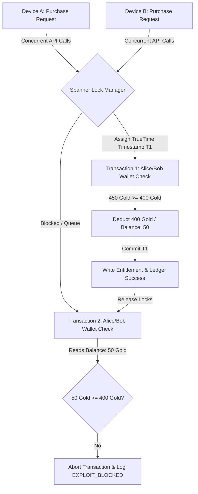

# ChronosLedger: Globally Distributed Virtual Economy & Entitlements Ledger

ChronosLedger is a gaming-commerce reference architecture built on **Google Cloud Spanner** and integrated with **Google Cloud Dataplex Knowledge Catalog** for data governance. It demonstrates how to build and orchestrate globally consistent virtual game economies, store checkouts, player entitlement ledgers, and catalog them for strict regulatory compliance (GDPR, AML).

---

## 🎮 The Business Challenge: Virtual Economy Exploits

For game studios, the virtual economy is the lifeblood of player revenue. A primary target for hackers is the **Item Duplication Exploit** (a race-condition hack). 
*   **The Scenario**: A player logs into their account on two devices simultaneously. They trigger a purchase for a high-value item (costing 400 gold) at the exact same millisecond, when their account balance is only enough for one (e.g., 450 gold).
*   **The Failure (Traditional Databases)**: Without complex, slow application-tier locking or strict serializable isolation, both transactions read the balance before either writes. Both approve, resulting in the player getting two items (duplication) and their balance dropping below zero—ruining the economy balance.
*   **The Spanner Wedge**: Spanner natively resolves this at the database engine tier, ensuring strict transaction ordering globally with zero lag-inducing locks.

---

## 🚀 The Technical Solution: Cloud Spanner & TrueTime

ChronosLedger showcases how Google Cloud Spanner solves global transactional consistency:

### Concurrency & Serialization Flow


### 1. TrueTime Atomic Clocks
Spanner uses **TrueTime**, a highly synchronized API backed by GPS receivers and atomic clocks inside Google data centers. 
TrueTime assigns absolute, globally ordered timestamps to transactions. Even if two checkout requests hit servers on opposite sides of the world (e.g., Tokyo and Frankfurt) at the same millisecond, Spanner knows which request arrived first and processes them sequentially.

### 2. Global Strict Serializability (ACID)
Spanner executes transactions under **Serializable Isolation** (the highest standard of transactional isolation):
1.  **Request 1 (Device A)**: Spanner lock manager acquires cells, reads Bob's balance (450 gold), verifies item stock, deducts 400 gold, records the entitlement, and commits the ledger transaction.
2.  **Request 2 (Device B)**: Spanner blocks this request until Request 1's commit phase finishes. It then reads the *new* state (50 gold balance), sees that Bob has insufficient funds, aborts the transaction, and logs a status of `EXPLOIT_BLOCKED` to the audit ledger.

---

## 🖥️ Live Exploit Simulation & TrueTime Inspector

The React interface displays a live dashboard of players and items, alongside a Spanner TrueTime Console terminal and a **TrueTime Transaction Inspector** side panel:


1.  **Bob's Wallets**: Bob starts with **450 gold**.
2.  **The Store**: The *Dragon Slayer Sword* costs **400 gold** (only 1 purchase is possible).
3.  **The Hack**: Clicking **"Execute Race-Condition Exploit"** fires two concurrent HTTP purchase requests (`POST /api/purchase`) simultaneously.
4.  **TrueTime Console Logs**:
    *   `[Device A] Initiating Purchase: Bob attempts to buy 'Dragon Slayer Sword'...`
    *   `[Device B] Initiating Purchase: Bob attempts to buy 'Dragon Slayer Sword'...`
    *   `🟢 [Device A Response - 200 OK] Success! Entitlement registered. Tx: tx-8e2b9213`
    *   `🔴 [Device B Response - 400 Failed] Exploit Blocked: Bob has insufficient gold.`
5.  **TrueTime Inspector Side Panel**: 
    *   Clicking on any transaction in the **ACID Transaction Ledger Audit Trail** or **Granted Player Entitlements** table loads the transaction in the side panel.
    *   Displays the **TrueTime Confidence Interval Window** including the Earliest Limit ($T - \epsilon$), Commit Timestamp ($T$), Latest Limit ($T + \epsilon$), and total Sync Uncertainty ($2\epsilon$) in milliseconds.
    *   Renders a visual timeline of the uncertainty window and the serialized commit point.
    *   Prints the raw API JSON response returned by the server.

---

## 🛡️ Data Governance with Dataplex Knowledge Catalog

In a production virtual economy, transactions are highly audited. ChronosLedger integrates with **Google Cloud Dataplex Knowledge Catalog** (Data Catalog) for schema stewardship, metadata discovery, and data governance:

1.  **Automated Metadata Harvesting**: Dataplex automatically crawls the Spanner databases and registers entries for the `players`, `items`, `entitlements`, and `ledger` tables.
2.  **Schema Classification & Policy Tagging**: Policy tags are applied to columns to restrict access to sensitive fields:
    *   `players.name` tagged as **`PII_LOW`** (Display name of the gaming profile).
    *   `players.balance` and `ledger.amount` tagged as **`SENSITIVE_FINANCIAL`** (Wallet balances and virtual transaction values).
    *   `ledger.status` tagged as **`AUDIT_COMPLIANCE`** (Auditing double-spend attempts).
    *   `entitlements.granted_at` and `ledger.timestamp` tagged as **`AUDITABLE`** (TrueTime serialization point).
3.  **Stewardship Tag Templates**: Enables data governance officers to apply templates for data ownership, classification (e.g. Restricted, Public), data retention policies, and data quality SLA scores.

---

## 🛠️ Tech Stack & Directory Layout

*   **Frontend**: React + Vite + Tailwind CSS dashboard (located under [chronos-ledger/frontend](file:///Users/priteshjani/Documents/jetski/chronos-ledger/frontend))
*   **Backend**: Python FastAPI backend service (located under [chronos-ledger/backend](file:///Users/priteshjani/Documents/jetski/chronos-ledger/backend))
*   **Database & Metadata Catalog**: Google Cloud Spanner & Google Cloud Dataplex (Data Catalog).

```text
chronos-ledger/
├── backend/
│   ├── main.py            # FastAPI backend server with Spanner ACID and Dataplex Catalog endpoints
│   ├── mock_spanner.py    # Python in-memory Spanner fallback emulator client
│   └── setup_spanner.py   # Seeding and database schema creation script
└── frontend/
    ├── index.html
    ├── package.json
    ├── vite.config.js
    └── src/
        ├── App.jsx        # React UI Client containing simulator, TrueTime inspector & Dataplex Catalog tabs
        ├── index.css
        └── main.jsx
```

---

## 🚀 How to Run the Demo

### 1. Database Option A: Connect to Live Spanner
You can either use a pre-existing Spanner database or spin up a new instance and database using Terraform:

#### Option A.1: Manual Setup & Seeding
Ensure you have active GCP credentials and Application Default Credentials (ADC) configured, then run:
```bash
gcloud auth application-default login
python3 chronos-ledger/backend/setup_spanner.py
```

#### Option A.2: Automated Provisioning via Terraform
If you want to spin up the entire Google Cloud infrastructure (including the Spanner instance, AlloyDB, and Cloud SQL databases) from scratch:
1. Navigate to the `terraform` directory:
   ```bash
   cd terraform
   ```
2. Initialize Terraform and apply the plan (you will be prompted to enter your active GCP Project ID):
   ```bash
   terraform init
   terraform apply -var="project_id=YOUR_PROJECT_ID"
   ```
   *This automatically enables all required APIs, creates the `spanner-demo-inst` instance, and provisions the `chronos-ledger-db` database with the correct schemas.*
3. Once completed, navigate back to the root folder:
   ```bash
   cd ..
   ```


### 2. Database Option B: Automatic Mock Fallback (No Credentials Needed)
If the backend server fails to establish a connection to a live Google Cloud Spanner instance on startup, it will **automatically fall back to a local, in-memory Mock Spanner client** built using SQLite. The database is pre-seeded instantly. 
*To force Mock mode explicitly, run the server with the environment variable:*
```bash
export USE_MOCK_SPANNER=true
```

### 3. Compile Frontend Static Bundle
Compile the React bundle:
```bash
cd chronos-ledger/frontend
npm install --registry=https://registry.npmjs.org/
npm run build
cd ../..
```

### 4. Run Backend Server Locally
Launch the backend server locally on port 3001 using the virtual environment:
```bash
source .venv/bin/activate
python3 chronos-ledger/backend/main.py
```
Open **`http://localhost:3001/`** in your browser.
